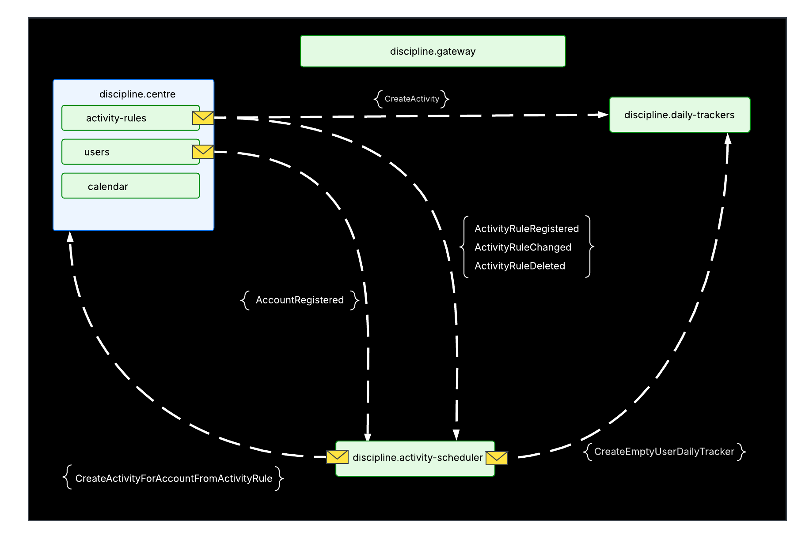

    

 

    <b>Discipline</b>

### Purpose
**Discipline** was created to help users track daily tasks and build positive habits. Thanks to flexible activity rules, schedules can be tailored to individual needs, making it easier to stay productive and organized.

### Implemented Features
- **Activities**
  - Add daily tasks  
  - Mark activities as completed  
  - Delete activities  
  - Create sub-tasks (stages) to support task completion  

- **Activity Rules**
  - Define activity recurrence modes: Daily, First/Last day of the week, First/Last day of the month, or custom-selected weekdays  
  - Edit existing rules  
  - Delete rules  
  - Manually generate activities based on rules  

- **Automatic Activity Generation**
  - Activities are automatically created for each day according to defined rules  

### Planned Features
- **User Profiles**: Support for multiple users with personalized settings and activity management  

---

### Architecture

- **Hybrid Approach**: The main application follows a modular monolith architecture, while additional services are implemented as microservices  

- **Feature-Based Organization**: The `discipline.activity-schedule` module is implemented using a Vertical Slice approach, where each feature is encapsulated in its own project across all layers  

- **Domain Models**: Business rules are enforced within domain models, ensuring that logic remains centralized, clean, and maintainable  

- **Database**
  - **MongoDB** stores the main application data  
  - **PostgreSQL** is used for the Activity Scheduler, Hangfire structures, and the outbox pattern  

- **CQRS (Command Query Responsibility Segregation)**: Separates read and write operations, improving scalability and performance  

- **Separeted shared libraries**: In project created shared separeted library projects with created solutions for infrastructure issues during working with project

    

